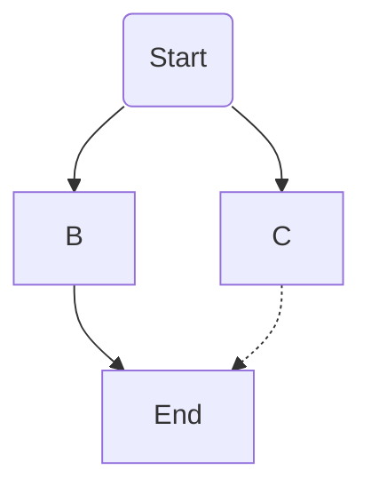

# Math Engine: Vector Addition

Testing writing

## MathJax test example

Here is an inline math example: $E=mc^2$.

Here is a block-level math example:

$$\int_0^\infty e^{-x^2} dx=\frac{\sqrt{\pi}}{2}$$

